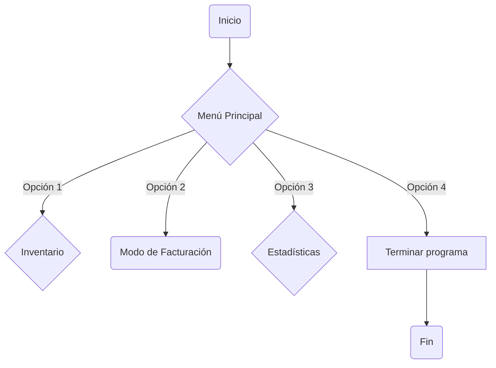
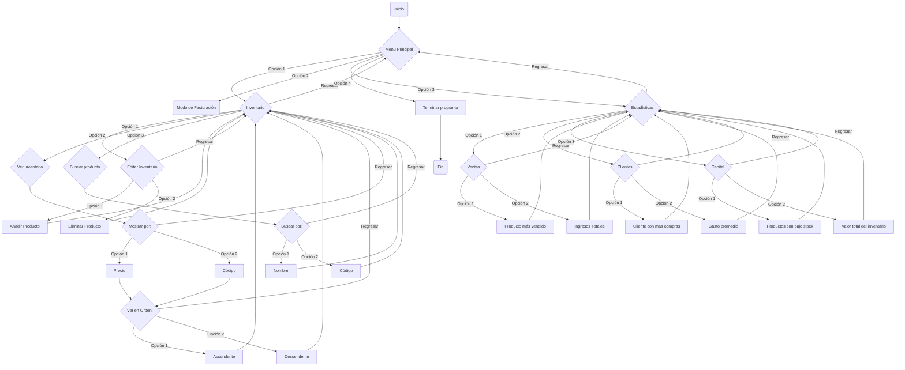

# Programa Auxiliar de Negocios KeyFacT
Proyecto de la Asignatura Programación de Computadores 2024-1
***

 [](https://postimg.cc/9D2jMgwD)
 
## Integrantes 
 * Kevin Daniel Castellanos Peña C.C. 1052338203
 * Julian Jacobo Gustin Moreno  T.I. 1081275973
 * Lucas Garcia Álvarez T.I. 1062434165

## Descripción del problema
Es muy común que a la hora de empezar con tu propio emprendimiento o idea de negocios te encuentres con dificultades para llevar registro de los movimientos, inventario, e incluso clientes de tu empresa, por lo que no es de extrañar que debido a la confusión muchos de estos negocios principiantes tiendan a sufrir grandes pérdidas e incluso tener que abandonar su actividad al no poder sobrellevar esta problemática.

Es por esto que el presente proyecto se diseñó como una aplicación modular, ofreciendo una solución simple e intuitiva para la gestión diaria del negocio, esta basada en la consola orientada para estas pequeñas empresas y se propone gestionar productos, clientes y facturas, asegurando un control ágil y eficiente del inventario y la facturación. Incluyendo características avanzadas como calculo de impuestos, manejo de presupuesto, rentabilidad de venta, gastos de la empresa, generación de reportes y estadisticas, y demás caracteristicas que serán desarrolladas en el código y reflejadas en los siguientes apartados.

El siguiente proyecto fue escogido ya que nos enfocamos en hacer algo útil y practico para quien requiera usar el programa, además de tener un rango de mejora inmenso dependiendo de las necesidades de cada usuario, lo que permite que sea aplicable en diversos contextos y empresas con requerimientos diferentes a los de las demás.

## Cómo abordamos el problema
Para poder llevar a cabo la resolución de esta problemática, nos encargamos de detallar las funciones que como mínimo el programa debería cumplir, teniendo en cuenta los requerimientos más generales de cualquier empresa y los que más relevancia tiene el mantener seguimiento.

En ese sentido se creó el siguiente diagrama en donde se reflejan estas funciones básicas:


Como se puede observar el foco del proyecto va en torno a las ventas, el inventario, los clientes y las estadísticas que todo emprendimiento necesita, en ese sentido, se diseñó el programa con la idea de poder llevar a cabo cálculos y seguimientos de estos aspectos.

Teniendo eso en cuenta
Primero hicimos el codigo lo principal de añadir y comprar y fuimos añadiendo funciones poco a poco hasta completar la interfaz prevista


## Solución planteada
### Funciones para cargar y guardar datos en archivo JSON
```python
import json
from datetime import datetime
import os
# Funcion para cargar datos desde un archivo JSON
def load_data(file_name):
    try:
        # Intenta abrir el archivo en modo de lectura
        with open(file_name, "r") as file: 
            #Carga el contendio del archivo y lo convierte en un diccionario
            return json.load(file) 
    except FileNotFoundError: 
        #si el archivo no existe, retorna un diccionario con listas vacias para clientes, stock y facturas
        return {"Clientes" : [], "Stock": [], "Facturas": [] } 

# Funcion para guardar datos en un archivo JSON
def save_data(file_name, data):
    #Abre el archivo en modo de escritura
    with open(file_name, "w") as file: 
        #Convierte el diccionario a JSON y lo escribe en el archivo
        json.dump(data, file, indent=4) 
    print("Los datos fueron guardados con exito")

```
***
### Funcion para inicializar las tablas en JSON
```python
# Funcion para crear la estructura inicial de las tablas en JSON
def initialize_data():
    if not os.path.exists("database.json"):
        # Crea un diccionario con listas vacias para clientes, stock y facturas
        data = {
            "Clientes": [],
            "Stock": [],
            "Facturas": [],
        }
        # Guardar el diccionario en un archivo JSON
        save_data("database.json", data)
        print("Datos inciales creados en database.json")
    else:
        print("El archivo JSON ya existe. No se realizaron cambios")
```
***
### Funcion principal de menú
```python
def menu(Interfaces: dict, bandera : bool):
    while bandera == True:
        # Mostrar el menú
        print(Interfaces["General"])
         
        try:
            a = int(input("Seleccione una opción: "))
        except ValueError:
            print("Por favor, ingrese un número entero válido.")
            continue
            
        # Ejecutar la opción seleccionada
        match a:
            case 1:
                invent(Interfaces, bandera)
            case 2:
                datafact()
            case 3:
                stats(Interfaces, bandera)
            case 4:
                print("Fin del programa")
                bandera = False
            case _:
                print("Opción no válida. Por favor, ingrese un número entre 1 y 4.")
```
***
### Funcion principal para gestionar la entrada de datos de una factura
```python
#Funcion para gestionar la entrada de datos de una factura
def datafact():
    # Cargar los datos desde el archivo JSON
    data = load_data("database.json")

    #Solicitar la cedula/ID del cliente
    cc = int(input("C.C: "))

    fecha = datetime.now().strftime("%Y-%m-%d")

    #Agrega el cliente a la lista de Clientes si no está registrado
    if not any(cliente["ID"] == cc for cliente in data["Clientes"]):
        data["Clientes"].append({"ID": cc, "Metodo_Pago": None, "Valor_Total_Compras": 0})

    total_factura = 0
    productos_comprados = []

    # Bucle para ingresar productos
    while True:
        codeprod = input("Codigo: ")
        if codeprod == "": 
            #Rompe el bucle si el codigo está vacio
            break
        codeprod = int(codeprod)

        #Obtener los detalles del producto
        datos_producto = ustock(codeprod, data)
        if datos_producto is None:
            print("Producto no encontrado.")
            continue
        
        # Verificar si el producto tiene un stock válido
        if datos_producto['Stock'] is None:
            print("Producto no encontrado.")
            continue
        
        unit = int(input("Unidades: "))

        # Verificar si hay suficiente stock
        if unit > datos_producto["Stock"]:
            print(f"Stock insuficiente para el producto {datos_producto['Producto']}, solo quedan {datos_producto['Stock']} unidades.")
            continue

        #Calcular el subtotal para este producto
        subtotal = datos_producto["PrecioU"] * unit
        total_factura += subtotal

        #Agrega el producto a la lista de productos comprados
        productos_comprados.append((codeprod, datos_producto["Producto"], datos_producto["Marca"], datos_producto["Presentacion"], datos_producto["PrecioU"],unit, subtotal))

        # Actualiza el stock del producto
        datos_producto["Stock"] -= unit
    
    save_data("database.json", data)
    
    # Agregar la factura a la lista de facturas
    data["Facturas"].append({
        "Factura_id": len(data["Facturas"]) + 1, # Incrementa el ID de factura
        "Cliente_id": cc,
        "Fecha": fecha,
        "Total": total_factura,
        "Productos": productos_comprados
    })

    #Guardar los cambios en el archivo JSON
    save_data("database.json", data)

    #Imprimir la información de la factura
    def imprimir_factura(factura):
        print(f"\nFactura ID: {factura['Factura_id']}")
        print(f"Fecha: {factura['Fecha']}")
        print(f"Cliente ID: {factura['Cliente_id']}")
        print("\nDetalle de Productos:")
        
        # Encabezado
        print(f"{'ID':<10} {'Producto':<20} {'Marca':<15} {'Presentación':<15} {'Precio Unitario':<15} {'Unidades':<10} {'Subtotal':<10}")
        print("="*85)
        
        # Datos de productos
        for producto in factura['Productos']:
            print(f"{producto[0]:<10} {producto[1]:<20} {producto[2]:<15} {producto[3]:<15} {producto[4]:<15.2f} {producto[5]:<10} {producto[6]:<10.2f}")
        
        # Total
        print("\nTotal de la Factura:")
        print(f"Total: {factura['Total']:.2f}")

    # Llamar a la función para imprimir la última factura agregada
    ultima_factura = data["Facturas"][-1]  # Obtiene la última factura agregada
    imprimir_factura(ultima_factura)
```
***
### Funciones para gestionar la entrada de datos de stock (agregar, eliminar)
```python
# Función para gestionar la entrada de datos de stock
def datastock():
    data = load_data("database.json")
    while True:
        print("Ingrese los datos del producto (ID vacio para finalizar): ")

        # Solicitar el ID del producto
        producto_id = input("ID del Producto: ")
        if producto_id == "":
            break

        # Solicitar otros detalles del producto
        Producto = input("Nombre del Producto: ")
        if Producto == "":
            break
        
        Marca = input("Marca: ")
        if Marca == "":
            break

        Presentacion = input("Presentación (kg): ")
        if Presentacion == "":
            break
        
        PrecioU = input("Precio: ")
        if PrecioU == "":
            break

        stock = input("Cantidad en Stock: ")
        if stock == "":
            break

        # Agregar el producto a la lista de Stock
        data["Stock"].append({
            "Producto_id": producto_id,
            "Producto": Producto,
            "Marca": Marca,
            "Presentacion": Presentacion,
            "PrecioU": float(PrecioU),
            "Stock": int(stock)
        })

        #Guardar los cambios
        save_data("database.json", data)
```
```python
#Funcion para eliminar un producto
def delete_product(product_id, data):
    # Obtener la lista de stock
    stock_list = data.get("Stock", [])
    # Comprobar si la lista de stock es None y convertirla a una lista vacía si es necesario
    if stock_list is None:
        stock_list = []
    # Buscar el producto con el ID dado
    for i in range(len(stock_list)):
        if int(stock_list[i]["Producto_id"]) == product_id:
            # Eliminar el producto de la lista
            del stock_list[i]
            return True
    return False
```
***
### Funciones para ver y buscar en el inventario
```python
def invent(Interfaces: dict, bandera : bool): # menu de inventario
    while bandera == True:
        print(Interfaces["Inventario"])
        try:
            a = int(input("Seleccione una opción: "))
        except ValueError:
            print("Por favor, ingrese un número entero válido.")
            continue

        # Ejecutar la opción seleccionada
        match a:
            case 1:
                inventEdit(Interfaces, bandera)
            case 2:
                inventShow(Interfaces, bandera)
            case 3:
                print(Interfaces["Búsqueda"])
                buscar_criterio = int(input("Seleccione una opción: "))
                search_product(buscar_criterio)
                continue
            case 4:
                break
            case _:
                print("Opción no válida. Por favor, ingrese un número entre 1 y 4.")

#Funcion para buscar un producto
def search_product(criterio):
    data = load_data("database.json")
    stock_list = data.get("Stock", [])
    if criterio == 1:
        nombre = input("Ingrese el nombre del producto: ").strip().lower()
        resultados = [producto for producto in stock_list if nombre in producto["Producto"].strip().lower()]
    elif criterio == 2:
        try:
            producto_id = int(input("Ingrese el ID del producto: ").strip())
            resultados = [producto for producto in stock_list if int(producto["Producto_id"]) == producto_id]
        except ValueError:
            print("ID inválido, Debe ser un número entero")
            resultados = []
    if resultados:
        print(f"{'ID':<10} {'Producto':<20} {'Marca':<15} {'Presentación':<15} {'Precio Unitario':<15} {'Stock':<10}")
        for producto in resultados:
            print(f"{producto['Producto_id']:<10} {producto['Producto']:<20} {producto['Marca']:<15} {producto['Presentacion']:<15} {producto['PrecioU']:<15} {producto['Stock']:<10}")
    else:
        print("No se encontraron productos que coincidan con los criterios de búsqueda.")
#Funcion para mostrar el inventario basado en los dos criterios anteriores
def mostrarInvent(a:int, b:int):
    data = load_data("database.json")
    stock_list = data.get("Stock", [])
    print("Funcion aún por diseñar")

    #Ordenar la lista en funcion del criterio seleccionado
    if a == 1:
        stock_list.sort(key=lambda x: x["PrecioU"], reverse=(b==2))
    elif a == 2:
        stock_list.sort(key=lambda x: x["Producto_id"], reverse=(b==2))
    print(f"{'ID':<10} {'Producto':<20} {'Marca':<15} {'Presentación':<15} {'Precio Unitario':<15} {'Stock':<10}")
    for producto in stock_list:
        print(f"{producto['Producto_id']:<10} {producto['Producto']:<20} {producto['Marca']:<15} {producto['Presentacion']:<15} {producto['PrecioU']:<15} {producto['Stock']:<10}")

def inventShow(Interfaces: dict, bandera : bool):
    while bandera == True:
        print(Interfaces["Visibilidad"])
        try:
            a = int(input("Seleccione una opción: "))
        except ValueError:
            print("Por favor, ingrese un número entero válido.")
            continue
        # Ejecutar la opción seleccionada
        match a:
            case 1:
                print("Filtro establecido: Por costo")
                a = 1
            case 2:
                print("Filtro establecido: Por ID")
                a = 2
            case 3:
                break
            case _:
                print("Opción no válida. Por favor, ingrese un número entre 1 y 3.")
        
        print(Interfaces["Orden"])
        try:
            b = int(input("Seleccione una opción: "))
        except ValueError:
            print("Por favor, ingrese un número entero válido.")
            continue 
        # Ejecutar la opción seleccionada
        match b:
            case 1:
                print("Orden establecido: Ascendente")
                b = 1
            case 2:
                print("Orden establecido: Descendente")
                b = 2
            case 3:
                break
            case _:
                print("Opción no válida. Por favor, ingrese un número entre 1 y 3.")
        
        mostrarInvent(a, b)
```
***
### Funciones de estadisticas
```python
def stats(Interfaces: dict, bandera : bool): # menu de estadisticas
    while bandera == True:
        print(Interfaces["Estadísticas"])
        try:
            a = int(input("Seleccione una opción: "))
        except ValueError:
            print("Por favor, ingrese un número entero válido.")
            continue

        # Ejecutar la opción seleccionada
        match a:
            case 1:
                sellstats(Interfaces, bandera)
            case 2:
                statsclients(Interfaces, bandera)
            case 3:
                budgetstats(Interfaces, bandera)
            case 4:
                break
            case _:
                print("Opción no válida. Por favor, ingrese un número entre 1 y 4.")

def sellstats(Interfaces: dict, bandera : bool):
    while bandera == True:
        print(Interfaces["Ventas"])
        try:
            a = int(input("Seleccione una opción: "))
        except ValueError:
            print("Por favor, ingrese un número entero válido.")
            continue 

    # Ejecutar la opción seleccionada
        match a:
            case 1:
                producto_mas_vendido()
            case 2:
                print("Funcion aún por diseñar")
            case 3:
                break
            case _:
                print("Opción no válida. Por favor, ingrese un número entre 1 y 3.")

def statsclients(Interfaces: dict, bandera : bool):
    while bandera == True:
        print(Interfaces["Clientes"])
        try:
            a = int(input("Seleccione una opción: "))
        except ValueError:
            print("Por favor, ingrese un número entero válido.")
            continue 

    # Ejecutar la opción seleccionada
        match a:
            case 1:
                print("Funcion aún por diseñar")
            case 2:
                print("Funcion aún por diseñar")
            case 3:
                break
            case _:
                print("Opción no válida. Por favor, ingrese un número entre 1 y 3.")

def budgetstats(Interfaces: dict, bandera : bool):
    while bandera == True:
        print(Interfaces["InvenStats"])
        try:
            a = int(input("Seleccione una opción: "))
        except ValueError:
            print("Por favor, ingrese un número entero válido.")
            continue 

    # Ejecutar la opción seleccionada
        match a:
            case 1:
                print("Funcion aún por diseñar")
            case 2:
                print("Funcion aún por diseñar")
            case 3:
                break
            case _:
                print("Opción no válida. Por favor, ingrese un número entre 1 y 3.")

def producto_mas_vendido():
    data = load_data("database.json")
    # Diccionario para contar las unidades vendidas por rproducto
    conteo_productos = {}
    #Iterar sobre todas las facturas
    for factura in data["Facturas"]:
        for producto in factura["Productos"]:
            id_producto = producto[0] # Indexar sobre las propiedades del producto
            unidades = producto[5]
            if id_producto in conteo_productos:
                conteo_productos[id_producto] += unidades
            else:
                conteo_productos[id_producto] = unidades
    
    if conteo_productos:
        producto_mas_vendido_id = max(conteo_productos, key=conteo_productos.get)
        producto = ustock(producto_mas_vendido_id, data)
        
        if producto:
            print("Producto más vendido:")
            print(f"ID: {producto['Producto_id']}")
            print(f"Nombre: {producto['Producto']}")
            print(f"Marca: {producto['Marca']}")
            print(f"Presentación: {producto['Presentacion']}")
            print(f"Precio Unitario: {producto['PrecioU']}")
            print(f"Unidades Vendidas: {conteo_productos[producto_mas_vendido_id]}")
        else:
            print("El producto más vendido no se encuentra en el stock.")
    else:
        print("No se han registrado ventas o no hay productos en el stock.")
```
***
### Main
```python
# Se declaran las variables contenedoras de interfaces y se llaman a las funciones
if __name__ == "__main__":
    initialize_data()
    bandera : bool = True
    I1 : str = """
Bienvenido al auxiliar de Negocios Kevlab \n
    |        Menú Principal       |
    |  1  |  Inventario           |
    |  2  |  Modo de Facturación  |
    |  3  |  Estadísticas         |
    |  4  |  Cerrar el programa   |
    """
    I2 : str = """
        Opciones de Inventario:
        |    Seleccione una opción    |
        |  1  |  Editar inventario    |
        |  2  |  Ver inventario       |
        |  3  |  Buscar producto      |
        |  4  |       Cancelar        |
    """
    
    I3 : str = """
        Editar Inventario
        |    Seleccione una opción    |
        |  1  | Añadir Producto       |
        |  2  | Eliminar Producto     |
        |  3  |       Cancelar        |
    """

    I4 : str = """
        Mostrar inventario
        |    Seleccione una opción    |
        |  1  | Por costo             |
        |  2  | Por ID                |
        |  3  |       Cancelar        |
    """
    I5 : str = """
        Mostrar inventario
        |    Seleccione una opción    |
        |  1  | Ascendente            |
        |  2  | Descendente           |
        |  3  |       Cancelar        |
    """

    I6 : str = """
        Opciones de Búsqueda:
        |    Seleccione una opción    |
        |  1  |  Por nombre           |
        |  2  |  Por ID               |
        |  3  |       Cancelar        |
    """

    I7 : str = """
        |        Estadísticas         |
        |  1  |       Ventas          |
        |  2  |       Clientes        |
        |  3  |       Capital         |
        |  4  |       Cancelar        |
    """
    I8 : str = """
        |   Estadísticas de Ventas    |
        |  1  | Producto más vendido  |
        |  2  |   Ingresos totales    |
        |  3  |       Cancelar        |
    """
    I9 : str = """
        |  Estadísticas de Clientes   |
        |  1  |Cliente con más compras|
        |  2  |    Gasto promedio     |
        |  3  |       Cancelar        |
    """
    I10 : str = """
        |   Estadísticas de Inventario  |
        |  1  | Productos con bajo stock |
        |  2  |Valor total del inventario|
        |  3  |         Cancelar         |
    """
    

    Interfaces: dict = {"General": I1,"Inventario":I2, "Editar": I3,"Visibilidad": I4, "Orden": I5}
    Interfaces.update({"Búsqueda" : I6, "Estadísticas": I7, "Ventas": I8, "Clientes": I9, "InvenStats": I10})

    menu(Interfaces, bandera)
```
## Instrucciones de uso
***
Cómo todo programa, este tiene un método para poder ser utilizado efectivamente y así llevar un total registro de los movimientos económicos que la empresa requiera.
### Instalación del programa
Para instalar el programa hay que seguir los pasos descritos a continuación:
- **Primero**: Hay que instalar el lenguaje de programación "python" en el sistema operativo.
      Para esto se debe ingresar a la página oficial y [descargar python](https://www.python.org/downloads/) en la versión más actual posible para tu sistema operativo, ya que dentro del código se utilizan estructuras como la de "match case" las cuales solo funcionan con versiones recientes, esta por ejemplo funciona de python 3.10 en adelante.
  
  Si estas usando Windows puedes comprobar que la instalación haya funcionado abriendo la consola de Windows, presionando (win + r), y escribir "python --version", si funcionó debería responder con la versión descargada y ya se tendría al interprete instalado, no obstante, si no funcionó tendrás que descargalo directamente en la tienda de Microsoft para luego ya realizar comprobación y muy seguramente ya habrá funcionado.
  
- **Segundo**: Descarga el archivo rar desde [este enlace](https://github.com/NotName-K/Project/blob/main/Kevlab.rar) y extraelo en una carpeta, encontrarás el archivo ejecutable del programa adentro.

### Cómo utilizarlo
Simplemente ejecuta el archivo .exe que encontrarás en la carpeta en la que descomprimiste el archivo .rar

Al iniciar el programa se abrirá el menú dentro de la terminal de Python en la parte baja de la interfaz del editor, allí se presentarán varias opciones según los requerimientos del usuario y este debe seleccionar el número de la opción que desee seleccionar.

Luego de realizar cualquier acción dentro de este programa se redigirá al usuario al menú inmediatamente anterior, por lo que para salir de este y darle fin ha de seleccionar "Cancelar" hasta llegar al menú principal donde debe elegir "Cerrar el Programa", en caso contrario, puede seguir eligiendo otras opciones y llevar a cabo otras funciones hasta donde el usuario lo desee.
