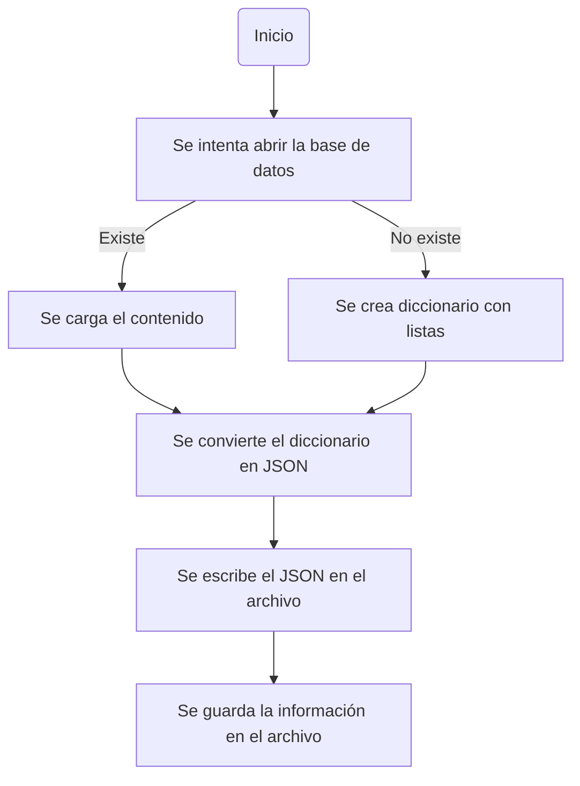
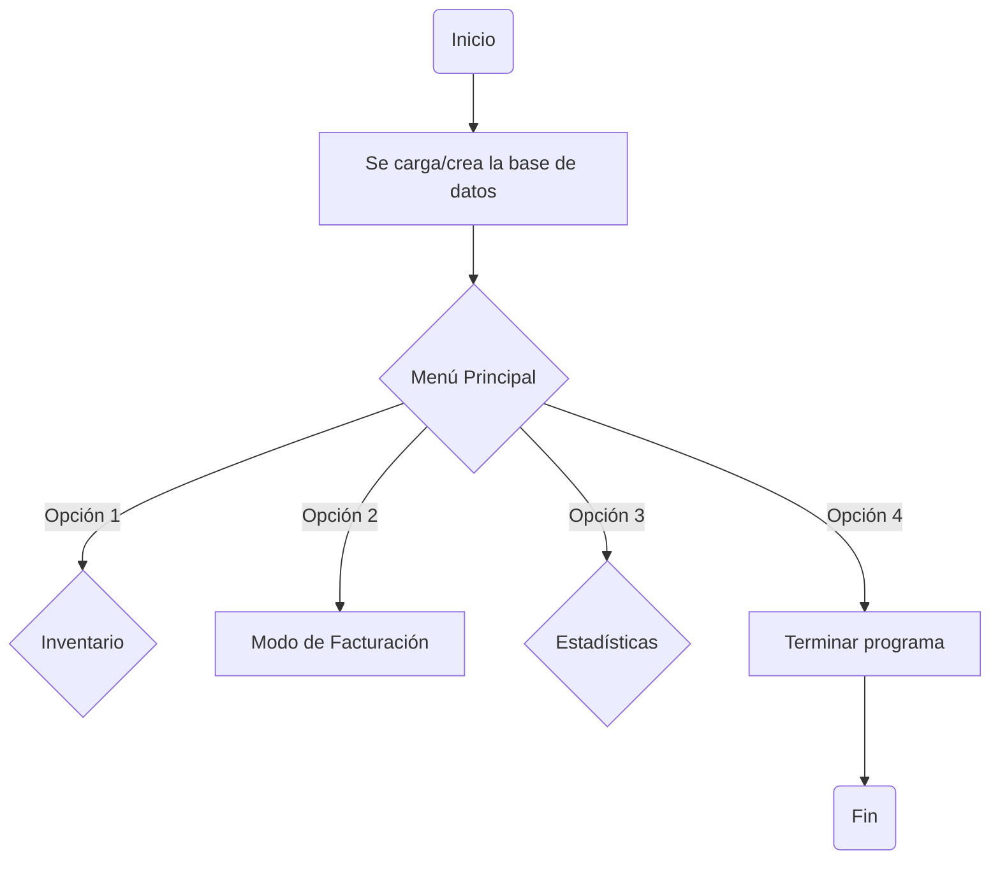
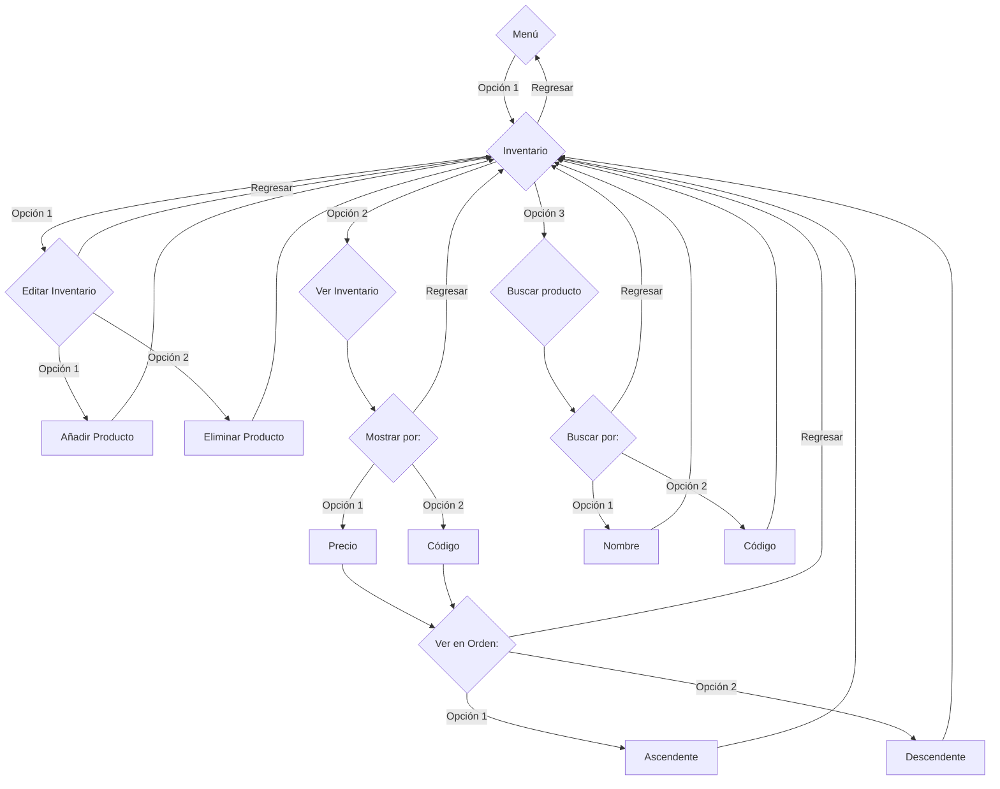
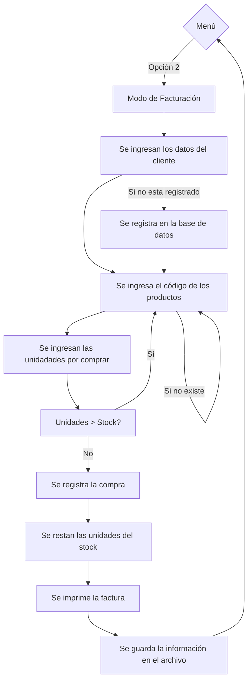
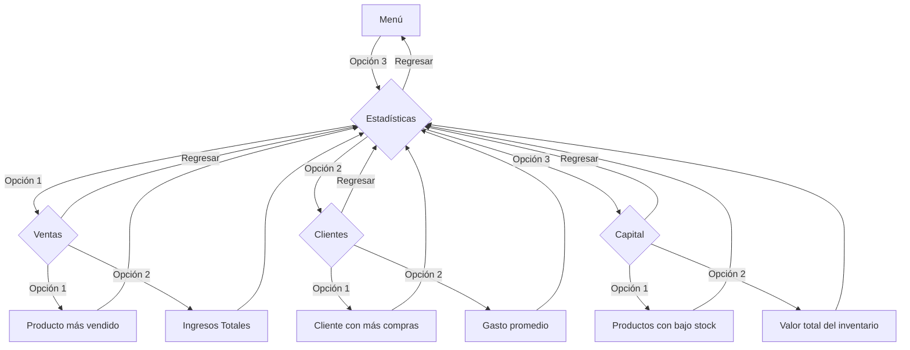
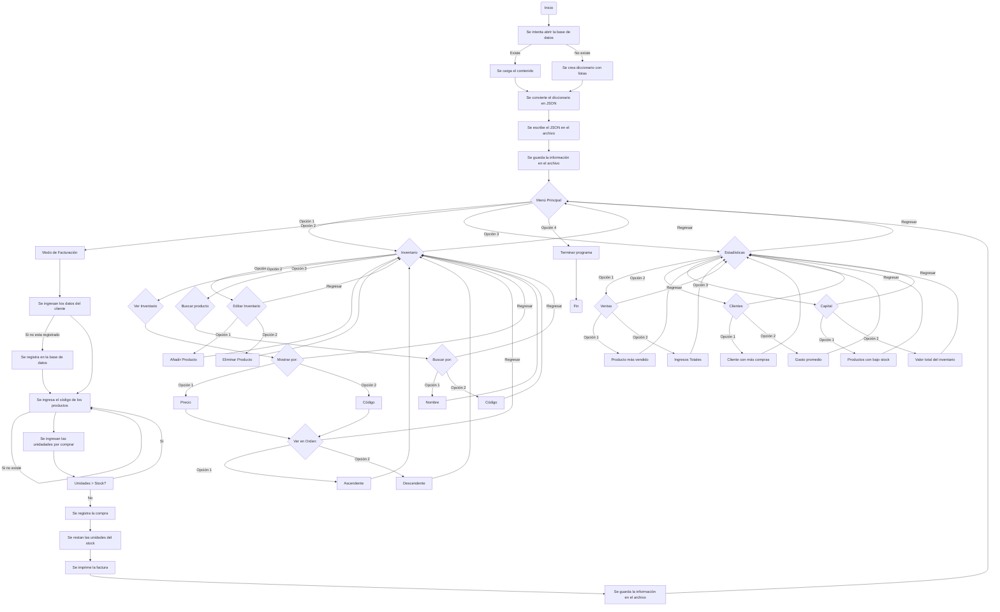

# Programa Auxiliar de Negocios KeyFacT
Proyecto de la Asignatura Programación de Computadores 2024-1
***


 
## Integrantes 
 * Kevin Daniel Castellanos Peña C.C. 1052338203
 * Julian Jacobo Gustin Moreno  T.I. 1081275973
 * Lucas Garcia Álvarez T.I. 1062434165

*Nota*: Este proyecto se llevó a cabo con la versión de python 3.12.5
## Descripción del problema
Es muy común que a la hora de empezar con tu propio emprendimiento o idea de negocios te encuentres con dificultades para llevar registro de los movimientos, inventario, e incluso clientes de tu empresa, por lo que no es de extrañar que debido a la confusión muchos de estos negocios principiantes tiendan a sufrir grandes pérdidas e incluso tener que abandonar su actividad al no poder sobrellevar esta problemática.

Es por esto que el presente proyecto se diseñó como una aplicación modular, ofreciendo una solución simple e intuitiva para la gestión diaria del negocio, esta basada en la consola orientada para estas pequeñas empresas y se propone gestionar productos, clientes y facturas, asegurando un control ágil y eficiente del inventario y la facturación. Incluyendo características avanzadas como calculo de impuestos, manejo de presupuesto, rentabilidad de venta, gastos de la empresa, generación de reportes y estadisticas, y demás caracteristicas que serán desarrolladas en el código y reflejadas en los siguientes apartados.

El siguiente proyecto fue escogido ya que nos enfocamos en hacer algo útil y practico para quien requiera usar el programa, además de tener un rango de mejora inmenso dependiendo de las necesidades de cada usuario, lo que permite que sea aplicable en diversos contextos y empresas con requerimientos diferentes a los de las demás.

## Cómo abordamos el problema
Primeramente, el programa debe funcionar en distintas ocasiones y debe guardar los datos ya registrados previamente para que se mantenga el seguimiento, por esto, se tuvo la necesidad de crear una base de datos para ello.

Esto puede llevarse a cabo de distintas formas, ya que inicialmente se probó con SQL, sin embargo, el equipo se decantó por usar archivos de texto con formato JSON debido a su mayor cercanía a los contenidos de la asignatura y su simpleza frente a otras alternativas; el funcionamiento se basa en que el programa lee un archivo llamado database.db, el cuál este mismo creará si no existe previamente, y en él se almancenan datos que al cargar se convierten en archivos JSON contenedores de las variables que requerimos y que se guardan en la misma base de datos.



Hecha la base de datos ya se pudo empezar a trabajar en la resolución de esta problemática, nos encargamos de detallar las funciones que como mínimo el programa debería cumplir, teniendo en cuenta los requerimientos más generales de cualquier empresa y los que más relevancia tiene el mantener seguimiento.

En ese sentido se creó el siguiente diagrama en donde se reflejan estas funciones básicas:


Como se puede observar el foco del proyecto va en torno a las ventas, el inventario, los clientes y las estadísticas que todo emprendimiento necesita, en ese sentido, se diseñó el programa con la idea de poder llevar a cabo cálculos y seguimientos de estos aspectos.

Teniendo eso en cuenta se creó un diseño modular en el que cada función se enuentra de un campo relativo al componente del que se relacione, por ejemplo, las opciones de ver el inventario o añadir algún producto a él están dentro del apartado "Inventario"; cada apartado tiene como acceso el menú principal desde donde inicia la interacción con el usuario y en donde terminará finalmente, puesto que la idea es que el usuario no tenga que ingresar repetidas veces en intervalos cortos de tiempo para, digamos, añadir 10 productos al inventario, de esta forma el usuario puede agregar estos productos o realizar cualquier otra acción las veces que desee y al final regresar al menú y cerrar el programa.


Posteriormente, se diseñó cada apartado teniendo en cuenta esas funciones que ya habíamos seleccionado y se aplicó el sistema modular propuesto al igual que se hizo con el menú principal.

- Inventario:

El apartado de Inventario debe incluir las opciones de añadir o eliminar productos, así como también de buscarlos bajo ciertos criterios, que posteriormente se definieron como el nombre o el ID de dichos productos; y finalmente el poder reflejarlos ordenados en la manera en que el usuario prefiera o necesite.


- Facturación:

Cómo tal no es un apartado, está dentro del menú principal debido a su indudable importancia a la hora de manejar negocios, ya que de ahí parten todas las demás funciones y estadísticas, y una buena parte del tiempo se empleará en facturar a los consumidores de los productos de la empresa.



- Estadísticas:

Para el apartado de estadísticas se planteó que el usuario pueda analizar el comportamiento de su empresa teniendo en cuenta variables como: el producto más vendido, Productos con bajo Stock o Gasto Promedio, utilizando el mismo sistema modular visto anteriormente dentro de las categorías "Ventas", "Clientes" y "Capital".

Al juntarse todos estos procesos se obtiene el siguiente resultado:


## Solución planteada

Luego de ya tener la idea de como llevar a cabo la solución de la problemática se inició la codificación de esta en el mismo orden en el que se planteó cada parte del programa.
### Inicializar, cargar y guardar datos en archivo JSON
En este caso, nos guiamos por los métodos dentro de la clase 18 de la asignatura "Diccionarios" y tal cómo se propuso en el diagrama de flujo, el programa lee, si existe o crea sino, el archivo de la base de datos y convierte sus datos a JSON para luego guardar cambios, si hubo, y utilizar la información de manera posterior.
```python
import json
from datetime import datetime
import os
# Funcion para cargar datos desde un archivo JSON
def load_data(file_name):
    try:
        # Intenta abrir el archivo en modo de lectura
        with open(file_name, "r") as file: 
            #Carga el contendio del archivo y lo convierte en un diccionario
            return json.load(file) 
    except FileNotFoundError: 
        #si el archivo no existe, retorna un diccionario con listas vacias para clientes, stock y facturas
        return {"Clientes" : [], "Stock": [], "Facturas": [] } 

# Funcion para guardar datos en un archivo JSON
def save_data(file_name, data):
    #Abre el archivo en modo de escritura
    with open(file_name, "w") as file: 
        #Convierte el diccionario a JSON y lo escribe en el archivo
        json.dump(data, file, indent=4) 
    print("Los datos fueron guardados con exito")

# Funcion para crear la estructura inicial de las tablas en JSON
def initialize_data():
    if not os.path.exists("database.json"):
        # Crea un diccionario con listas vacias para clientes, stock y facturas
        data = {
            "Clientes": [],
            "Stock": [],
            "Facturas": [],
        }
        # Guardar el diccionario en un archivo JSON
        save_data("database.json", data)
        print("Datos inciales creados en database.json")
    else:
        print("El archivo JSON ya existe. No se realizaron cambios")
```
***
### Interfaz Gráfica y sistema modular
Tal como se indicó desde el inicio, uno de los puntos clave del programa es ser sencillo de utilizar y permitir desplazarse entre cada módulo o apartado sin ningún problema, para esto se utilizó la estructura match case, en donde el usuario selecciona el número de una de las opciones impresas en la terminal y el programa lo redigirá al apartado o acción deseada.

Para facilitar la comprensión de la métodología propuesta el grupo llevó a cabo la creación de "Interfaces" guardadas en cadenas de caracteres, y estas a su vez en diccionarios para facilitar su ingreso a las funciones y acceso dentro de estas.

```python
# Ejemplo de módulo
def menu(Interfaces: dict, bandera : bool):
    while bandera == True:
        # Mostrar el menú
        print(Interfaces["General"])
         
        try:
            a = int(input("Seleccione una opción: "))
        except ValueError:
            print("Por favor, ingrese un número entero válido.")
            continue
            
        # Ejecutar la opción seleccionada
        match a:
            case 1:
                invent(Interfaces, bandera)
            case 2:
                datafact()
            case 3:
                stats(Interfaces, bandera)
            case 4:
                print("Fin del programa")
                bandera = False
            case _:
                print("Opción no válida. Por favor, ingrese un número entre 1 y 4.")

# Ejemplo de Interfaz
I1 : str = """
Bienvenido al auxiliar de Negocios Kevlab \n
    |        Menú Principal       |
    |  1  |  Inventario           |
    |  2  |  Modo de Facturación  |
    |  3  |  Estadísticas         |
    |  4  |  Cerrar el programa   |
    """
```
***
### Funcion principal para gestionar la entrada de datos de una factura
En esta función se lleva a cabo el proceso de facturar una compra, para esto se carga el archivo y se obtiene el stock de cada producto del inventario, se ingresa el cliente y se registra si aún no lo está, luego se busca por el ID el producto y se digita las unidades que se desean adquirir, si cualquiera de estos datos no concuerda se regresa a ingresar el código y unas unidades aceptables, cuando ello suceda, se registrará la compra y la factura en la base de datos, se reducirá el stock del producto y se imprimirá la factura con la fecha exacta.

```python
#Funcion para gestionar la entrada de datos de una factura
def datafact():
    # Cargar los datos desde el archivo JSON
    data = load_data("database.json")

    #Solicitar la cedula/ID del cliente
    cc = int(input("C.C: "))

    fecha = datetime.now().strftime("%Y-%m-%d")

    #Agrega el cliente a la lista de Clientes si no está registrado
    if not any(cliente["ID"] == cc for cliente in data["Clientes"]):
        data["Clientes"].append({"ID": cc, "Metodo_Pago": None, "Valor_Total_Compras": 0})

    total_factura = 0
    productos_comprados = []

    # Bucle para ingresar productos
    while True:
        codeprod = input("Codigo: ")
        if codeprod == "": 
            #Rompe el bucle si el codigo está vacio
            break
        codeprod = int(codeprod)

        #Obtener los detalles del producto
        datos_producto = ustock(codeprod, data)
        if datos_producto is None:
            print("Producto no encontrado.")
            continue
        
        # Verificar si el producto tiene un stock válido
        if datos_producto['Stock'] is None:
            print("Producto no encontrado.")
            continue
        
        unit = int(input("Unidades: "))

        # Verificar si hay suficiente stock
        if unit > datos_producto["Stock"]:
            print(f"Stock insuficiente para el producto {datos_producto['Producto']}, solo quedan {datos_producto['Stock']} unidades.")
            continue

        #Calcular el subtotal para este producto
        subtotal = datos_producto["PrecioU"] * unit
        total_factura += subtotal

        #Agrega el producto a la lista de productos comprados
        productos_comprados.append((codeprod, datos_producto["Producto"], datos_producto["Marca"], datos_producto["Presentacion"], datos_producto["PrecioU"],unit, subtotal))

        # Actualiza el stock del producto
        datos_producto["Stock"] -= unit
    
    save_data("database.json", data)
    
    # Agregar la factura a la lista de facturas
    data["Facturas"].append({
        "Factura_id": len(data["Facturas"]) + 1, # Incrementa el ID de factura
        "Cliente_id": cc,
        "Fecha": fecha,
        "Total": total_factura,
        "Productos": productos_comprados
    })

    #Guardar los cambios en el archivo JSON
    save_data("database.json", data)

    #Imprimir la información de la factura
    def imprimir_factura(factura):
        print(f"\nFactura ID: {factura['Factura_id']}")
        print(f"Fecha: {factura['Fecha']}")
        print(f"Cliente ID: {factura['Cliente_id']}")
        print("\nDetalle de Productos:")
        
        # Encabezado
        print(f"{'ID':<10} {'Producto':<20} {'Marca':<15} {'Presentación':<15} {'Precio Unitario':<15} {'Unidades':<10} {'Subtotal':<10}")
        print("="*85)
        
        # Datos de productos
        for producto in factura['Productos']:
            print(f"{producto[0]:<10} {producto[1]:<20} {producto[2]:<15} {producto[3]:<15} {producto[4]:<15.2f} {producto[5]:<10} {producto[6]:<10.2f}")
        
        # Total
        print("\nTotal de la Factura:")
        print(f"Total: {factura['Total']:.2f}")

    # Llamar a la función para imprimir la última factura agregada
    ultima_factura = data["Facturas"][-1]  # Obtiene la última factura agregada
    imprimir_factura(ultima_factura)
```
***
### Funciones para gestionar la entrada de datos de stock (agregar, eliminar)
Para agregar un dato al inventario se abre el archivo y cargan sus datos, luego se indican todos los datos asociados al producto (ID, Nombre, Marca, Presentación, Precio, Unidades en stock), se añade a la lista de stock y se guardan los cambios.

Por otra parte, para eliminar un producto se abre el archivo y esta misma lista donde se encuentra cada producto, se busca por el ID ingresado y se elimina de la lista.
```python
# Función para gestionar la entrada de datos de stock
def datastock():
    data = load_data("database.json")
    while True:
        print("Ingrese los datos del producto (ID vacio para finalizar): ")

        # Solicitar el ID del producto
        producto_id = input("ID del Producto: ")
        if producto_id == "":
            break

        # Solicitar otros detalles del producto
        Producto = input("Nombre del Producto: ")
        if Producto == "":
            break
        
        Marca = input("Marca: ")
        if Marca == "":
            break

        Presentacion = input("Presentación (kg): ")
        if Presentacion == "":
            break
        
        PrecioU = input("Precio: ")
        if PrecioU == "":
            break

        stock = input("Cantidad en Stock: ")
        if stock == "":
            break

        # Agregar el producto a la lista de Stock
        data["Stock"].append({
            "Producto_id": producto_id,
            "Producto": Producto,
            "Marca": Marca,
            "Presentacion": Presentacion,
            "PrecioU": float(PrecioU),
            "Stock": int(stock)
        })

        #Guardar los cambios
        save_data("database.json", data)
```
```python
#Funcion para eliminar un producto
def delete_product(product_id, data):
    # Obtener la lista de stock
    stock_list = data.get("Stock", [])
    # Comprobar si la lista de stock es None y convertirla a una lista vacía si es necesario
    if stock_list is None:
        stock_list = []
    # Buscar el producto con el ID dado
    for i in range(len(stock_list)):
        if int(stock_list[i]["Producto_id"]) == product_id:
            # Eliminar el producto de la lista
            del stock_list[i]
            return True
    return False
```
***
### Funciones para ver y buscar en el inventario
Para poder visualizar el inventario primeramente se pregunta al usuario el criterio por el cual se van a ordenar los productos, en este caso se cuenta con dos, el precio y el ID, además de esto se debe ingresar si se desea un orden ascendente o descendente, esto dependiendo de cómo le sea más útil al usuario dicha información, para luego ordenar la lista de stock con base a los criterios seleccionados e imprimir los resultados.
```python
def inventShow(Interfaces: dict, bandera : bool):
    while bandera == True:
        print(Interfaces["Visibilidad"])
        try:
            a = int(input("Seleccione una opción: "))
        except ValueError:
            print("Por favor, ingrese un número entero válido.")
            continue
        # Ejecutar la opción seleccionada
        match a:
            case 1:
                print("Filtro establecido: Por costo")
                a = 1
            case 2:
                print("Filtro establecido: Por ID")
                a = 2
            case 3:
                break
            case _:
                print("Opción no válida. Por favor, ingrese un número entre 1 y 3.")
        
        print(Interfaces["Orden"])
        try:
            b = int(input("Seleccione una opción: "))
        except ValueError:
            print("Por favor, ingrese un número entero válido.")
            continue 
        # Ejecutar la opción seleccionada
        match b:
            case 1:
                print("Orden establecido: Ascendente")
                b = 1
            case 2:
                print("Orden establecido: Descendente")
                b = 2
            case 3:
                break
            case _:
                print("Opción no válida. Por favor, ingrese un número entre 1 y 3.")
        
        mostrarInvent(a, b)

#Funcion para mostrar el inventario basado en los dos criterios anteriores
def mostrarInvent(a:int, b:int):
    data = load_data("database.json")
    stock_list = data.get("Stock", [])
    print("Funcion aún por diseñar")

    #Ordenar la lista en funcion del criterio seleccionado
    if a == 1:
        stock_list.sort(key=lambda x: x["PrecioU"], reverse=(b==2))
    elif a == 2:
        stock_list.sort(key=lambda x: x["Producto_id"], reverse=(b==2))
    print(f"{'ID':<10} {'Producto':<20} {'Marca':<15} {'Presentación':<15} {'Precio Unitario':<15} {'Stock':<10}")
    for producto in stock_list:
        print(f"{producto['Producto_id']:<10} {producto['Producto']:<20} {producto['Marca']:<15} {producto['Presentacion']:<15} {producto['PrecioU']:<15} {producto['Stock']:<10}")
```
A su vez, para buscar algún producto se utiliza una estrategia similar, se carga la información del archivo y se obtiene la lista de stock, de donde por medio del nombre o del ID el usuario busca el producto deseado.
```python
#Funcion para buscar un producto
def search_product(criterio):
    data = load_data("database.json")
    stock_list = data.get("Stock", [])
    if criterio == 1:
        nombre = input("Ingrese el nombre del producto: ").strip().lower()
        resultados = [producto for producto in stock_list if nombre in producto["Producto"].strip().lower()]
    elif criterio == 2:
        try:
            producto_id = int(input("Ingrese el ID del producto: ").strip())
            resultados = [producto for producto in stock_list if int(producto["Producto_id"]) == producto_id]
        except ValueError:
            print("ID inválido, Debe ser un número entero")
            resultados = []
    if resultados:
        print(f"{'ID':<10} {'Producto':<20} {'Marca':<15} {'Presentación':<15} {'Precio Unitario':<15} {'Stock':<10}")
        for producto in resultados:
            print(f"{producto['Producto_id']:<10} {producto['Producto']:<20} {producto['Marca']:<15} {producto['Presentacion']:<15} {producto['PrecioU']:<15} {producto['Stock']:<10}")
    else:
        print("No se encontraron productos que coincidan con los criterios de búsqueda.")
```
***
### Funciones de estadisticas
Se implementa el diseño modular y la estructura match case para el funcionamiento del menú y la elección de opciones por el usuario.
```python
def stats(Interfaces: dict, bandera : bool): # Menu de estadisticas
    while bandera == True:
        print(Interfaces["Estadísticas"])
        try:
            a = int(input("Seleccione una opción: "))
        except ValueError:
            print("Por favor, ingrese un número entero válido.")
            continue

        # Ejecutar la opción seleccionada
        match a:
            case 1:
                sellstats(Interfaces, bandera)
            case 2:
                statsclients(Interfaces, bandera)
            case 3:
                budgetstats(Interfaces, bandera)
            case 4:
                break
            case _:
                print("Opción no válida. Por favor, ingrese un número entre 1 y 4.")

# Función para ver estadísticas de venta
def sellstats(Interfaces: dict, bandera : bool): 
    while bandera == True:
        print(Interfaces["Ventas"])
        try:
            a = int(input("Seleccione una opción: "))
        except ValueError:
            print("Por favor, ingrese un número entero válido.")
            continue 

    # Ejecutar la opción seleccionada
        match a:
            case 1:
                producto_mas_vendido()
            case 2:
                IngresosTotales()
            case 3:
                break
            case _:
                print("Opción no válida. Por favor, ingrese un número entre 1 y 3.")

# Función para ver estadísticas de clientes
def statsclients(Interfaces: dict, bandera : bool):
    while bandera == True:
        print(Interfaces["Clientes"])
        try:
            a = int(input("Seleccione una opción: "))
        except ValueError:
            print("Por favor, ingrese un número entero válido.")
            continue 

    # Ejecutar la opción seleccionada
        match a:
            case 1:
                clientemascompras()
            case 2:
                promxclcom()
            case 3:
                break
            case _:
                print("Opción no válida. Por favor, ingrese un número entre 1 y 3.")

# Función para ver estadísticas del inventario
def budgetstats(Interfaces: dict, bandera : bool):
    while bandera == True:
        print(Interfaces["InvenStats"])
        try:
            a = int(input("Seleccione una opción: "))
        except ValueError:
            print("Por favor, ingrese un número entero válido.")
            continue 

    # Ejecutar la opción seleccionada
        match a:
            case 1:
                bajostock()
            case 2:
                valtotinv()
            case 3:
                break
            case _:
                print("Opción no válida. Por favor, ingrese un número entre 1 y 3.")
```
Dentro de este menú, cómo podemos apreciar contamos con las siguientes seis opciones para poder analizar el inventario, las ventas y los clientes.
- Ingresos Totales
```python
# Función para obtener los ingresos totales entre determinadas fechas
def IngresosTotales(): 
    data = load_data("database.json")
    IngresoNeto: int = 0
    fechas: list = []
    for i in data["Facturas"]:
       Ingreso = i.get("Total")
       IngresoNeto += Ingreso
       fechas.append(i.get("Fecha"))
    fechas.sort()
    print("Ingresos Totales: ")
    print(f"EL Total de Ingresos entre {fechas[0]} y {fechas[-1]} es {int(IngresoNeto)}")
```
- Producto más vendido
```python
# Función para mostrar el producto más vendido
def producto_mas_vendido():
    data = load_data("database.json")
    # Diccionario para contar las unidades vendidas por rproducto
    conteo_productos = {}
    #Iterar sobre todas las facturas
    for factura in data["Facturas"]:
        for producto in factura["Productos"]:
            id_producto = producto[0] # Indexar sobre las propiedades del producto
            unidades = producto[5]
            if id_producto in conteo_productos:
                conteo_productos[id_producto] += unidades
            else:
                conteo_productos[id_producto] = unidades
    
    if conteo_productos:
        producto_mas_vendido_id = max(conteo_productos, key=conteo_productos.get)
        producto = ustock(producto_mas_vendido_id, data)
        
        if producto:
            print("Producto más vendido:")
            print(f"ID: {producto['Producto_id']}")
            print(f"Nombre: {producto['Producto']}")
            print(f"Marca: {producto['Marca']}")
            print(f"Presentación: {producto['Presentacion']}")
            print(f"Precio Unitario: {producto['PrecioU']}")
            print(f"Unidades Vendidas: {conteo_productos[producto_mas_vendido_id]}")
        else:
            print("El producto más vendido no se encuentra en el stock.")
    else:
        print("No se han registrado ventas o no hay productos en el stock.")
```
- Cliente con más compras
```python
# Función para obtener y guardar el ID de los clientes, sin repetirse
def idclientsord():
    data = load_data("database.json")
    idclientesfact : list = []
    for i in data["Facturas"]:
        idclientesfact.append(i.get("Cliente_id"))
    idfactn = set(idclientesfact)
    return idfactn

# Función para contar la cantidad de facturas por cada cliente e imprimir el cliente con mayor cantidad de estas
def clientemascompras():
    data = load_data("database.json") 
    while bandera == True:
        print(Interfaces["Clientbuy"])
        try:
            a = int(input("Seleccione una opción: "))
        except ValueError:
            print("Por favor, ingrese un número entero válido.")
            continue 

        match a:
            case 1:
              cantfact = []
              for i in idclientsord():
                  facturas = 0
                  for j in data["Facturas"]:
                    if i == j["Cliente_id"]:
                      facturas += 1
                    cantfact.append([int(facturas), i])
              cantfact.sort(reverse=True)
              print(f"El cliente con mas facturas tiene ID {cantfact[0][1]} con un total de {cantfact[0][0]} facturas.")
            case 2:
              idtotal = []
              for i in idclientsord():
                  Invertido = 0
                  for j in data["Facturas"]:
                    if i == j["Cliente_id"]:
                      Invertido += j["Total"]
                  idtotal.append([int(Invertido), i])
              idtotal.sort(reverse=True) 
              print(f"El cliente que mas ha gastado tiene ID {idtotal[0][1]} con {idtotal[0][0]} gastados ")
            case 3:
                break
            case _:
                print("Opción no válida. Por favor, ingrese un número entre 1 y 3.")
```
- Promedio de compras por cliente:
```python
#Función para acumular el dinero invertido en todos los productos vendidos y al dividirlo por el número de clientes, se obtiene el promedio de compras por cliente
def promxclcom():
    data = load_data("database.json") 
    while bandera == True:
        print(Interfaces["Clientprom"])
        try:
            a = int(input("Seleccione una opción: "))
        except ValueError:
            print("Por favor, ingrese un número entero válido.")
            continue 

        match a:
            case 1:
                 Invertido = 0
                 for i in idclientsord():
                  for j in data["Facturas"]:
                    if i == j["Cliente_id"]:
                      Invertido += j["Total"]
                 promxcl = Invertido / len(idclientsord())
                 print(f"El gasto promedio por cliente es {int(promxcl)}")

            case 2:
                 inv = 0
                 facturas = 0
                 for i in data["Facturas"]:
                     inv += i["Total"]
                     facturas += 1
                 print(f"El gasto promedio por cliente es {int(inv / facturas)}")
            case 3:
                break
            case _:
                print("Opción no válida. Por favor, ingrese un número entre 1 y 3.")

- Productos con Bajo Stock

# Se ingresa un valor mínimo que debe tener de stock los productos, si alguno tiene menos se imprime
def bajostock():
    bandera: bool = False
    a = int(input("Ingrese el valor mínimo de stock para filtrar: "))
    data = load_data("database.json")
    # Almacenar los productos con bajo stock en una lista
    for i in data['Stock']:
        if i['Stock'] < a:
            bandera : bool = True
            producto_info = f"{i["Producto"]} {i["Marca"]} {i["Presentacion"]}"
            print(f"El producto {producto_info} está agotado o por agotarse, {i["Stock"]} unidades") 
             # Devuelve la lista de productos con bajo stock
    if not bandera:
        print("No hay ningún producto con stock por debajo de esa cantidad")
```
- Valor total del inventario
```python
# Se cuenta el valor total de cada producto, multiplicando su precio unitario por su stock, se suman estos y se obtiene el valor del inventario
def valtotinv():
   vltotal = 0
   data = load_data("database.json") 
   for i in data['Stock']:
       vltotal += i['Stock']*i['PrecioU']
   print(F"El valor Total del inventario es {int(vltotal)}")
```
***
### Función Main y Apartado Gráfico en detalle
Contiene las interfaces que ya se describieron, se llaman a las funciones para inicializar la base de datos y se imprime la interfaz del menú.
```python
# Se declaran las variables contenedoras de interfaces y se llaman a las funciones
if __name__ == "__main__":
    initialize_data()
    bandera : bool = True
    I1 : str = """
Bienvenido al auxiliar de Negocios Keyfact \n
    |        Menú Principal       |
    |  1  |  Inventario           |
    |  2  |  Modo de Facturación  |
    |  3  |  Estadísticas         |
    |  4  |  Cerrar el programa   |
    """
    I2 : str = """
        Opciones de Inventario:
        |    Seleccione una opción    |
        |  1  |  Editar inventario    |
        |  2  |  Ver inventario       |
        |  3  |  Buscar producto      |
        |  4  |       Atras           |
    """
    
    I3 : str = """
        Editar Inventario
        |    Seleccione una opción    |
        |  1  | Añadir Producto       |
        |  2  | Eliminar Producto     |
        |  3  |       Atras           |
    """

    I4 : str = """
        Mostrar inventario
        |    Seleccione una opción    |
        |  1  | Por costo             |
        |  2  | Por ID                |
        |  3  |       Atras           |
    """
    I5 : str = """
        Mostrar inventario
        |    Seleccione una opción    |
        |  1  | Ascendente            |
        |  2  | Descendente           |
        |  3  |       Atras           |
    """

    I6 : str = """
        Opciones de Búsqueda:
        |    Seleccione una opción    |
        |  1  |  Por nombre           |
        |  2  |  Por ID               |
        |  3  |       Atras           |
    """

    I7 : str = """
        |        Estadísticas         |
        |  1  |       Ventas          |
        |  2  |       Clientes        |
        |  3  |       Capital         |
        |  4  |       Atras           |
    """
    I8 : str = """
        |   Estadísticas de Ventas    |
        |  1  | Producto más vendido  |
        |  2  |   Ingresos totales    |
        |  3  |       Atras           |
    """
    I9 : str = """
        |  Estadísticas de Clientes   |
        |  1  |Cliente con más compras|
        |  2  |    Gasto promedio     |
        |  3  |       Atras           |
    """
    I10 : str = """
        |   Estadísticas de Inventario   |
        |  1  | Productos con bajo stock |
        |  2  |Valor total del inventario|
        |  3  |         Atras            |
    """
    I11 : str = """
        |   Clientes con más compras     |
        |  1  |  Por Numero de Facturas  |
        |  2  |  Por Dinero Gastado      |
        |  3  |         Atras            |
    """ 
    I12 : str = """
        |           Gasto Promedio       |
        |  1  |      Por Cliente         |
        |  2  |      Por Factura         |
        |  3  |         Atras            |
    """ 

    Interfaces: dict = {"General": I1,"Inventario":I2, "Editar": I3,"Visibilidad": I4, "Orden": I5, "Búsqueda" : I6}
    Interfaces.update({"Estadísticas": I7, "Ventas": I8, "Clientes": I9, "InvenStats": I10, "Clientbuy": I11, "Clientprom": I12})

    menu(Interfaces, bandera)
```
## Instrucciones de uso
***
Cómo todo programa, este tiene un método para poder ser utilizado efectivamente y así llevar un total registro de los movimientos económicos que la empresa requiera.
### Instalación del programa
Para instalar el programa hay que seguir los pasos descritos a continuación:
- **Primero**: Hay que instalar el lenguaje de programación "python" en el sistema operativo.
      Para esto se debe ingresar a la página oficial y [descargar python](https://www.python.org/downloads/) en la versión más actual posible para tu sistema operativo, ya que dentro del código se utilizan estructuras como la de "match case" las cuales solo funcionan con versiones recientes, esta por ejemplo funciona de python 3.10 en adelante.
  
  Si estas usando Windows puedes comprobar que la instalación haya funcionado abriendo la consola de Windows, presionando (win + r), y escribir "python --version", si funcionó debería responder con la versión descargada y ya se tendría al interprete instalado, no obstante, si no funcionó tendrás que descargalo directamente en la tienda de Microsoft para luego ya realizar comprobación y muy seguramente ya habrá funcionado.
  
- **Segundo**: Debes descargar el [programa](https://github.com/NotName-K/Project/blob/main/ProyectoAuxiliarDeNegocios.py) de python y abrirlo en un editor de código como puede ser [Visual Studio Code](https://code.visualstudio.com/download), o si prefieres descarga el archivo .exe desde [este enlace](https://github.com/NotName-K/Project/blob/main/ProyectoAuxiliarDeNegocios.exe) y ejecutalo. 

### Cómo utilizarlo

En caso de preferir el archivo .exe, simplemente ejecutalo después de descargarlo.

Si el usuario utiliza el editor de código, debe utilizar la opción "File" en el extremo superior izquierdo de la interfaz de Visual Studio y seleccionar "Open New File", en la venta emergente ha de ubicar y abrir el archivo "ProyectoAuxiliarDeNegocios.py", de ahí utiliza el símbolo de "Play" o "Resumir" en la esquina superior derecha del editor, esta tiene como nombre "Run Python File", al hacer click esta dará inicio al programa.

Al iniciar, el programa abrirá el menú dentro de la terminal de Python en la parte baja de la interfaz del editor, allí se presentarán varias opciones según los requerimientos del usuario y este debe seleccionar el número de la opción que desee seleccionar.

Luego de realizar cualquier acción dentro de este programa se redigirá al usuario al menú inmediatamente anterior, por lo que para salir de este y darle fin ha de seleccionar "Cancelar" hasta llegar al menú principal donde debe elegir "Cerrar el Programa", en caso contrario, puede seguir eligiendo otras opciones y llevar a cabo otras funciones hasta donde el usuario lo desee.

